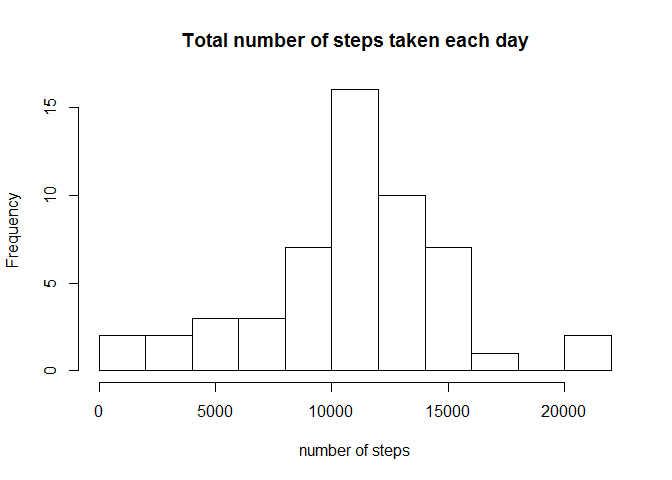
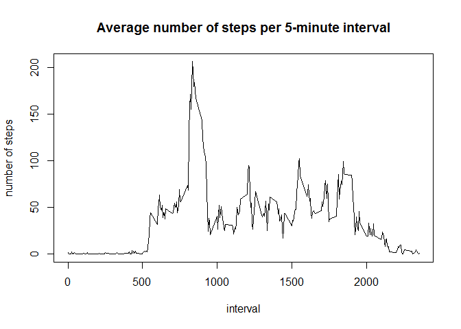
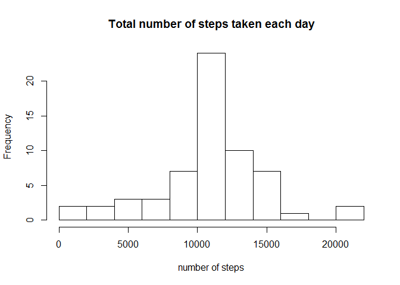
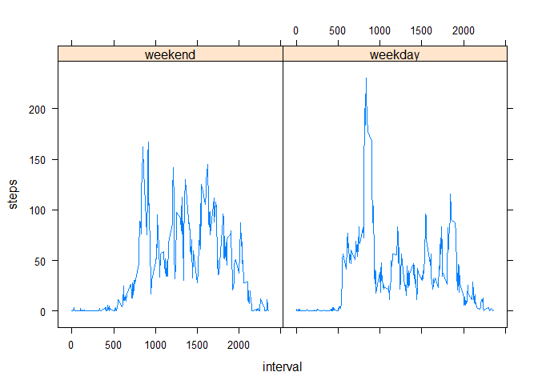

# Reproducible Research: Peer Assessment 1
This project studies the average number of steps taken per day by a person. The data was recorded by a personal activity monitoring device. The data can be downloaded [here](https://d396qusza40orc.cloudfront.net/repdata%2Fdata%2Factivity.zip).

We first load the `dplyr` and `lattice` packages. These should be installed before running the project.


```r
library(dplyr,quietly=TRUE)
library(lattice,quietly=TRUE)
```

## Loading and preprocessing the data

The data should first be saved in the R working directory. The code below will unzip the data if needed, and read it into a table `act`. The values in the `date` column are converted from strings into the `Date` class in R.


```r
if(!file.exists("activity.csv")) {
  unzip("activity.zip")
}
act <- read.csv("activity.csv")
act$date <- as.Date(act$date)
```

## What is mean total number of steps taken per day?

To answer this question, we need to group the data by date, and then sum the number of steps for each day. The result will be 'NA' for some days which don't have data for the number of steps. These days are ignored in the code below that histograms, and calculates the mean and median of the number of steps.


```r
act2<-group_by(act,date)
actsumm<-summarize(act2,steps=sum(steps))

hist(actsumm$steps,breaks=10,main="Total number of steps taken each day",xlab="number of steps")
```

<!-- -->

```r
mean(actsumm$steps,na.rm=TRUE)
```

```
## [1] 10766.19
```

```r
median(actsumm$steps,na.rm=TRUE)
```

```
## [1] 10765
```

## What is the average daily activity pattern?

To calculate the number of steps per 5-minute interval averaged over all days, we need to group the data by interval instead of date. We then plot the average number of steps taken per interval.


```r
act2<-group_by(act,interval)
actsumm<-summarize(act2,steps=mean(steps,na.rm=TRUE))
plot(actsumm$interval,actsumm$steps,type="l",main="Average number of steps per 5-minute interval",xlab="interval",ylab="number of steps")
```

<!-- -->

The code below shows the interval that corresponds to the maximum number of steps.


```r
actsumm[actsumm$steps==max(actsumm$steps),]$interval
```

```
## [1] 835
```

## Imputing missing values


```r
nrow(subset(act,is.na(steps)))
```

```
## [1] 2304
```
Thus there are 2304 entries in the input data set where the 'steps' information is missing. To deal with the missing values in the input data set, we replace each 'NA' value with the average for the corresponding time interval. 


```r
intervals<-actsumm$interval
for (i in 1:nrow(act)) {
    if (is.na(act[i,1])) {
        interval <- act[i,3]
        for (j in 1:288) {
            if (intervals[j]==interval) {
                act[i,1]<-actsumm[j,2]
                break
            }
        }
    }
}
```

We then histogram, and calculate the mean and median of the number of steps per day, as before.

```r
act2<-group_by(act,date)
actsumm<-summarize(act2,steps=sum(steps,na.rm=TRUE))

hist(actsumm$steps,breaks=10,main="Total number of steps taken each day",xlab="number of steps")
```

<!-- -->

```r
mean(actsumm$steps)
```

```
## [1] 10766.19
```

```r
median(actsumm$steps)
```

```
## [1] 10766.19
```
We see that the mean has not changed, while the median changed slightly from 10765 to 10766.19. Note that the median is not an integer number anymore, because we entered floats into the table during the imputing procedure.

## Are there differences in activity patterns between weekdays and weekends?

To answer this question, we calculate a new variable `weekday` in the table that separates between week days and weekend days. After grouping the data by this categorical variable, we can then plot the data for week days and weekend days separately.


```r
weekday<-weekdays(act$date)
isweekendday <- weekday=="Sunday" | weekday=="Saturday"
act$weekday<-factor(isweekendday,levels=c(TRUE,FALSE),labels=c("weekend","weekday"))
act2<-group_by(act,weekday,interval)
actsumm<-summarize(act2,steps=mean(steps))
xyplot(steps ~ interval | weekday,actsumm,type="l")
```

<!-- -->

We see that there are some marked differences in the activity patterns between the two categories. In particular, activity tends to start later in the day during weekends.
